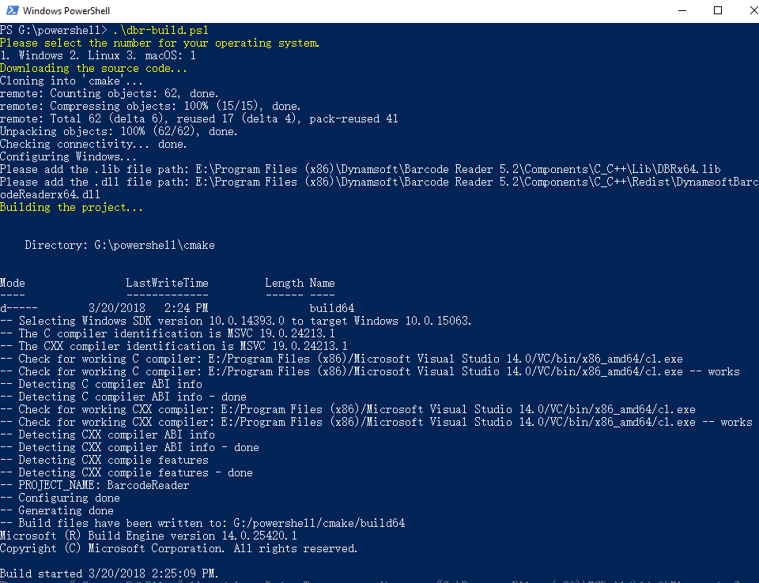

# Auto-building Barcode Reader Project
Build a cross-platform barcode reader app with PowerShell scripts on **Windows**, **Linux** and **macOS**.

## Prerequisites
- [CMake](https://cmake.org/download/)
- [Dynamsoft Barcode Reader](https://www.dynamsoft.com/Downloads/Dynamic-Barcode-Reader-Download.aspx)
- [PowerShell](https://github.com/PowerShell/PowerShell)
- [Git](https://git-scm.com/downloads)

## How Does the Script Work
1. Select your operating system.
2. Get the source code of barcode reader app.
3. Set the absolute path of your barcode SDK.
4. Build the project.
5. Run the app.

